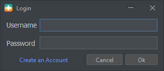
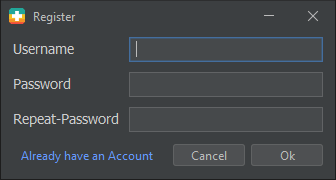
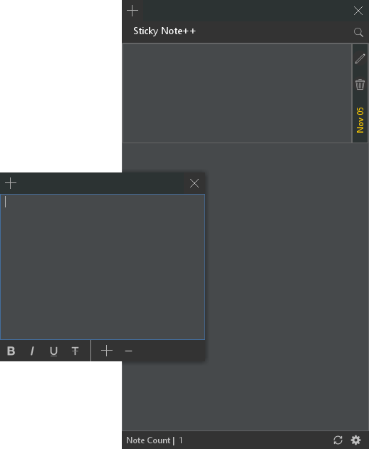
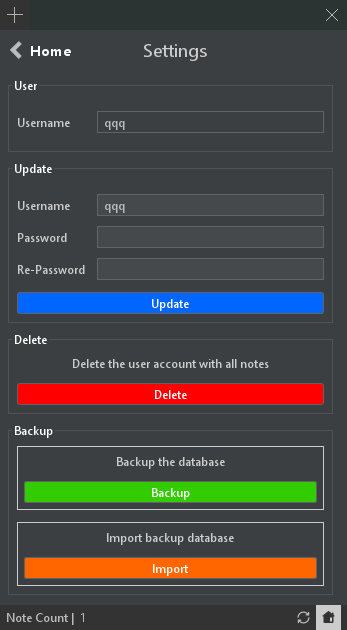

# Sticky Note++

Sticky Note++ is an enhanced version of the traditional Windows Sticky Note application with advanced features for security, user accounts, and data backup.

## Features

### 1. User Account Login

Sticky Note++ allows users to create and log in to their accounts. This feature ensures user-specific access and provides an additional layer of security.

### 2. Secure Note Encryption

All notes created with Sticky Note++ are automatically encrypted to protect sensitive information. The encryption ensures that only authorized users can access the content.

### 3. Data Backup and Restoration

Sticky Note++ enables users to back up their entire note database into an encrypted file. This backup file can be transferred and used on another device running Sticky Note++. This feature ensures seamless continuity and data accessibility on multiple devices.

### 4. Intuitive Sticky Note Interface

The application provides a user-friendly and intuitive interface, making it easy to create, edit, and organize sticky notes.

## Sample Pictures

Here are some sample pictures illustrating the Sticky Note++ interface:

## How Sticky Note++ Works

1. **User Registration and Login**:
   - Users can create an account by providing a username and a secure password.
   - After registration, users can log in with their credentials.

2. **Creating and Managing Sticky Notes**:
   - Users can create new sticky notes with titles and content.
   - Sticky notes can be organized, edited, and deleted as needed.

3. **Note Encryption**:
   - Sticky Note++ automatically encrypts each note to protect the content. Encryption is applied at the note level, ensuring data security.

4. **Data Backup**:
   - Users can create a backup of their note database. The backup file is encrypted and can be saved on local storage or in the cloud.

5. **Restoring Data on Another Device**:
   - To use Sticky Note++ on another device, users can import their encrypted backup file.
   - The application decrypts the backup and allows users to access their notes seamlessly.

## Security

Sticky Note++ takes user data security seriously. The application uses strong encryption methods to protect all notes and ensures that only authorized users can access the content.

## Download JAR Dependencies

You can download all the JAR file dependencies for the project from this link: [Download JAR Dependencies](https://drive.google.com/drive/folders/1XhWFWgjjjJv5ScclvqVWTKVLKrfFDzTN?usp=sharing)

## Conclusion

Sticky Note++ offers an enhanced and secure alternative to traditional sticky note applications. With user account login, note encryption, and data backup features, users can trust that their notes are safe and accessible across different devices.
